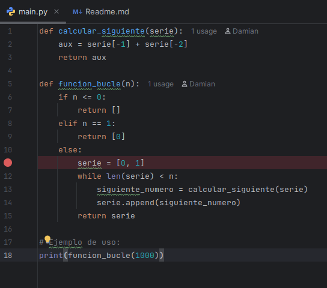
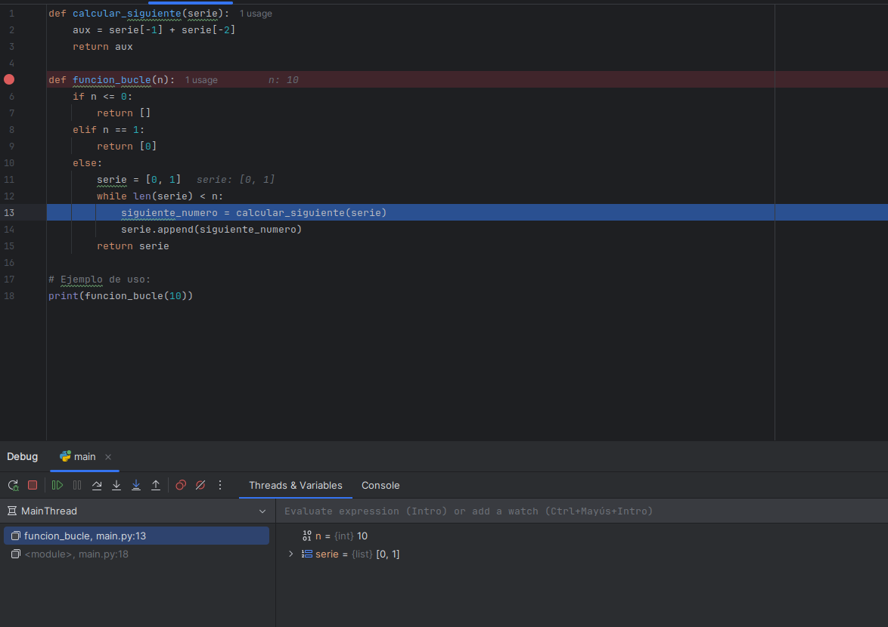
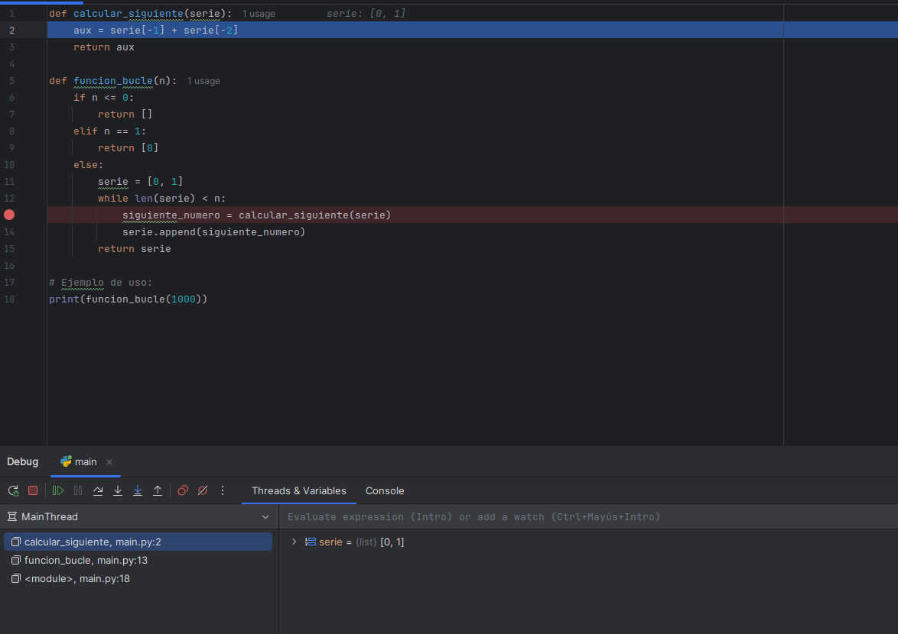
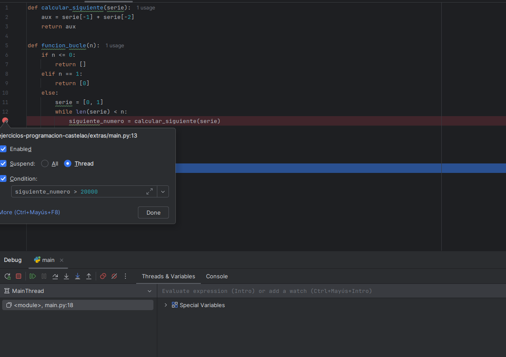

# Examen de Depuración en PyCharm

---

## **Instrucciones:**

1. Realiza un fork de este repositorio y clónalo.
1. Las respuestas a las preguntas realízalas en este Readme
2. Cada pregunta vale un punto

### Apartado 1

- Coloca un punto de interrupción **normal** en la línea donde se inicializa la lista de la serie: `serie = [0, 1]`. 
- Inicia el modo *Debug*.



**Pregunta**

1. Si la función es llamada con `n=10`, ¿cuál es el valor de la variable `n` que se visualiza en la ventana de variables del debugger justo antes de que se ejecute la línea `serie = [0, 1]`?

Respuesta = `n = 10`

---

### Apartado 2

-  Asegúrate de que la llamada a la función es `print(funcion_bucle(10))`.
-  Inicia el modo *Debug* y avanza hasta que la ejecución se detenga en la línea `siguiente_numero = calcular_siguiente(serie)`.
-  Utiliza la opción de depuración adecuada para **entrar dentro** de la función `calcular_siguiente`.




**Preguntas**

1. Justo cuando el debugger se detiene dentro de la función `calcular_siguiente` por **primera vez**, ¿cuál es el valor que tiene la variable local `aux` *después* de que se ejecute la línea `aux = serie[-1] + serie[-2]`?
**(Indica el valor numérico exacto de la variable `aux` en ese momento y el nombre de la herramienta de *debugging* que utilizaste para entrar en la función).**

Respuesta =
```
Valor de aux: 1
Herramienta de debugging utilizada: Step Into
```


2. Si estuvieras dentro de la función `calcular_siguiente` y quisieras salir rápidamente sin ejecutar el resto de las líneas, volviendo al punto de llamada en `funcion_bucle`, ¿qué función del debugger deberías usar?

Respuesta = ```Step Out```

3. ¿Qué diferencia fundamental existe entre usar *Step Over* y *Step Into* en la línea `siguiente_numero = calcular_siguiente(serie)`?

Respuesta =
```
Step Over: ejecuta la función completa sin entrar en su código, avanzando a la siguiente línea del programa actual.

Step Into: entra dentro de la función calcular_siguiente y permite depurar su ejecución línea a línea.
```

---

### Apartado 3

-  Cambia la llamada a la función para que el número de elementos sea mayor: `print(funcion_bucle(1000))`.
-  Establece un **Breakpoint Condicional** para que la ejecución se detenga solo cuando `siguiente_numero` sea **mayor que 20000**.



**Pregunta**

1. Cuando el *Breakpoint Condicional* se activa por **primera vez** (la primera vez que `siguiente_numero` es mayor que 20000), ¿qué longitud tiene `serie`?

Respuesta = ```23```

---
